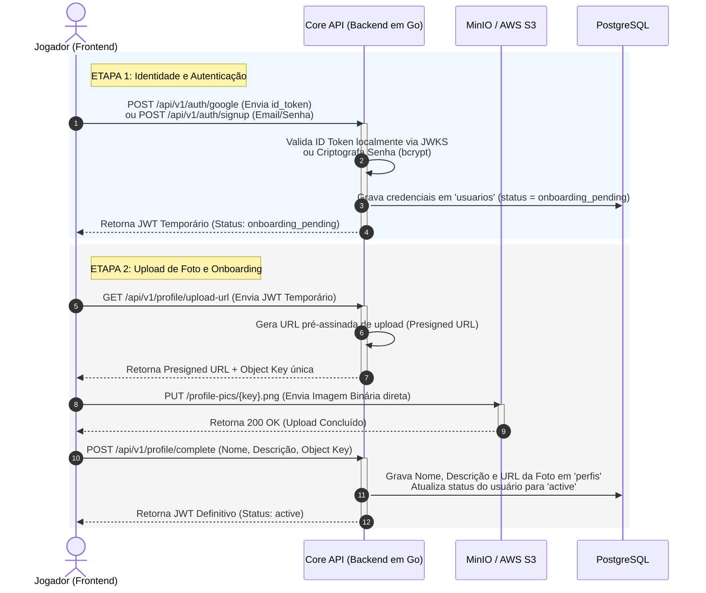

g de Usuário (OAuth, Presigned URLs e JWT)

- **Status:** Aceito
- **Data:** 2026-05-29
- **Autor:** Antigravity & Jogador (Co-Designers)

### 1. Contexto e Declaração do Problema

O onboarding de novos jogadores na plataforma Snooker Multiplayer deve ser seguro, de altíssimo desempenho e proporcionar uma experiência ágil (UX). O processo envolve criar a identidade (Google OAuth ou Email/Senha), fazer o upload de uma foto de perfil, e cadastrar dados básicos (Nome e Descrição).
Para evitar sobrecarga de transferência de arquivos binários nos microsserviços em Go e simplificar a arquitetura, precisamos de fluxos otimizados para upload de arquivos e validação de sessão.

### 2. Decisões Arquiteturais Adotadas

Aprovamos em sessão conjunta as seguintes escolhas técnicas:

1. **Validação de Login Google OAuth por ID Token (JWKS):**
   - O aplicativo frontend obtém o `id_token` do Google e o envia ao backend em Go.
   - O Go valida a assinatura do token localmente utilizando as chaves públicas da Google (JWKS em cache), sem precisar fazer chamadas externas adicionais a cada login.
2. **Sessões Stateless baseadas em JWT (JSON Web Tokens):**
   - A autenticação gera um token JWT criptografado assinado com chave privada contendo o ID do usuário e seu estado de registro (`onboarding_pending` ou `active`).
   - O JWT é enviado no cabeçalho `Authorization: Bearer <token>` de todas as chamadas HTTP e no handshake inicial do WebSocket.
3. **Upload de Foto via Presigned URLs (MinIO/S3):**
   - O upload de imagens binárias é realizado pelo cliente diretamente para o Object Storage (MinIO local / AWS S3 em produção) usando uma URL temporária autorizada gerada pelo backend em Go.
4. **Confirmação Síncrona do Perfil pelo Frontend:**
   - O cliente executa o upload da foto diretamente no MinIO/S3, obtém sucesso e finaliza síncronamente enviando os metadados (Nome, Descrição e Chave da Foto) para a Core API em Go registrar tudo no PostgreSQL e promover a conta ao status `active`.

---

### 3. Diagrama do Fluxo Detalhado de Cadastro e Onboarding

---

### 4. Consequências e Impactos

- **Impacto Positivo:** Desempenho excelente e economia severa de banda e processamento do backend (toda a transferência pesada de arquivos é direcionada para o MinIO/S3). Segurança máxima utilizando assinaturas JWT locais e validação JWKS do Google.
- **Impacto Negativo/Riscos:** A expiração do link presigned deve ser curta para evitar abusos na gravação de lixo no Storage.
- **Ações de Mitigação:** Configurar o tempo de expiração do Presigned URL para no máximo 5 minutos e aplicar políticas de expiração de objetos não associados no MinIO/S3 (Lifecycle Rules para limpar uploads órfãos após 24 horas).
