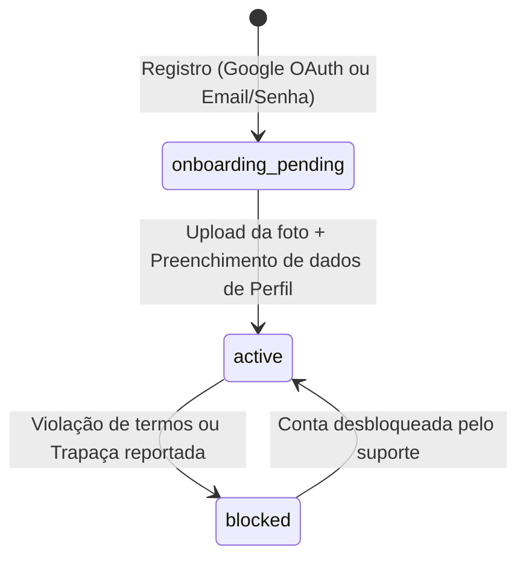

# Arquitetura Completa do Sistema de Autenticação e Onboarding

Este documento especifica a totalidade da arquitetura técnica da camada de Autenticação e Onboarding de Usuários da plataforma Snooker Multiplayer. Ele servirá como o blueprint definitivo para a implementação do banco de dados, rotas de API, segurança e integrações com armazenamento de objetos.

---

## 1. Modelo de Dados (Esquema PostgreSQL)

A persistência será dividida em duas tabelas principais para separar dados de login/credenciais (segurança) de dados públicos de exibição (perfil).

```sql
-- Habilitar extensão para geração de UUID
CREATE EXTENSION IF NOT EXISTS "uuid-ossp";

-- Definição dos Status da Conta
CREATE TYPE user_status AS ENUM ('onboarding_pending', 'active', 'blocked');
CREATE TYPE auth_provider AS ENUM ('local', 'google');

-- Tabela: usuarios
CREATE TABLE usuarios (
    id UUID PRIMARY KEY DEFAULT uuid_generate_v4(),
    email VARCHAR(255) UNIQUE NOT NULL,
    password_hash VARCHAR(255) NULL, -- Nulo se for OAuth (Google)
    provider auth_provider NOT NULL DEFAULT 'local',
    status user_status NOT NULL DEFAULT 'onboarding_pending',
    created_at TIMESTAMP WITH TIME ZONE DEFAULT CURRENT_TIMESTAMP,
    updated_at TIMESTAMP WITH TIME ZONE DEFAULT CURRENT_TIMESTAMP
);

-- Tabela: perfis
CREATE TABLE perfis (
    id UUID PRIMARY KEY DEFAULT uuid_generate_v4(),
    user_id UUID UNIQUE NOT NULL REFERENCES usuarios(id) ON DELETE CASCADE,
    display_name VARCHAR(50) NOT NULL,
    bio VARCHAR(200) DEFAULT '',
    photo_url VARCHAR(512) DEFAULT '',
    updated_at TIMESTAMP WITH TIME ZONE DEFAULT CURRENT_TIMESTAMP
);

-- Índices para otimização de consultas frequentes
CREATE INDEX idx_usuarios_email ON usuarios(email);
CREATE INDEX idx_usuarios_status ON usuarios(status);
```

---

## 2. Máquina de Estados da Conta do Usuário

O ciclo de vida da conta possui transações e regras rígidas de segurança em cada estado:



### Regras de Transição de Estado:
1.  **Registro (`onboarding_pending`):**
    *   O usuário é inserido na tabela `usuarios`.
    *   Nenhum registro correspondente existe ainda na tabela `perfis`.
    *   O JWT emitido contém a claim `"status": "onboarding_pending"`.
    *   Este token permite acesso **exclusivo** às rotas `/api/v1/profile/upload-url` e `/api/v1/profile/complete`. Qualquer outra chamada retorna `403 Forbidden`.
2.  **Ativação (`active`):**
    *   Após o preenchimento bem-sucedido dos dados em `/api/v1/profile/complete`.
    *   Gera um registro na tabela `perfis` associado ao `user_id`.
    *   O status do usuário na tabela `usuarios` é atualizado para `active`.
    *   Um novo JWT definitivo é emitido com a claim `"status": "active"`, liberando acesso a lobbies, partidas e chats.

---

## 3. Especificação e Contratos de API (Endpoints)

Todas as requisições e respostas de sucesso utilizam JSON. Endpoints protegidos exigem o cabeçalho: `Authorization: Bearer <JWT>`.

### 3.1. Criar Conta Local (Email & Senha)
*   **Endpoint:** `POST /api/v1/auth/signup`
*   **Autenticação:** Nenhuma
*   **Request Payload:**
    ```json
    {
      "email": "jogador@exemplo.com",
      "password": "senhaSegura123!"
    }
    ```
*   **Validações:**
    *   E-mail deve ser válido.
    *   Senha deve ter no mínimo 8 caracteres, contendo pelo menos 1 número e 1 caractere especial.
*   **Response (201 Created):**
    ```json
    {
      "message": "Conta criada com sucesso",
      "token": "eyJhbGciOi...",
      "status": "onboarding_pending"
    }
    ```

### 3.2. Login Local
*   **Endpoint:** `POST /api/v1/auth/login`
*   **Autenticação:** Nenhuma
*   **Request Payload:**
    ```json
    {
      "email": "jogador@exemplo.com",
      "password": "senhaSegura123!"
    }
    ```
*   **Response (200 OK):**
    ```json
    {
      "token": "eyJhbGciOi...",
      "status": "active" -- ou "onboarding_pending" dependendo do estado no BD
    }
    ```
*   **Erro (401 Unauthorized):** Credenciais inválidas ou incorretas.

### 3.3. Autenticação Google OAuth
*   **Endpoint:** `POST /api/v1/auth/google`
*   **Autenticação:** Nenhuma
*   **Request Payload:**
    ```json
    {
      "id_token": "eyJhbGciOiJSUzI1Ni..." -- JWT emitido diretamente pelo Google Client SDK
    }
    ```
*   **Response (200 OK / 201 Created):**
    ```json
    {
      "token": "eyJhbGciOi...",
      "status": "active" -- ou "onboarding_pending" se for o primeiro login
    }
    ```

### 3.4. Solicitar Link de Upload (Presigned URL)
*   **Endpoint:** `GET /api/v1/profile/upload-url`
*   **Autenticação:** Requer JWT (Status `onboarding_pending` ou `active`)
*   **Response (200 OK):**
    ```json
    {
      "upload_url": "https://minio.snooker.local/profile-pics/c39d8923-a5ff-4bc1-9c88.png?X-Amz-Signature=...",
      "object_key": "c39d8923-a5ff-4bc1-9c88.png"
    }
    ```

### 3.5. Completar Perfil (Finalizar Onboarding)
*   **Endpoint:** `POST /api/v1/profile/complete`
*   **Autenticação:** Requer JWT (Estrito para Status `onboarding_pending`)
*   **Request Payload:**
    ```json
    {
      "display_name": "CoryWong",
      "bio": "Mestre da sinuca com efeito.",
      "photo_key": "c39d8923-a5ff-4bc1-9c88.png"
    }
    ```
*   **Validações:**
    *   `display_name` deve ter entre 3 e 50 caracteres (apenas letras, números e underline).
    *   `bio` máximo de 200 caracteres.
    *   `photo_key` deve ser um nome de arquivo válido no formato UUID gerado pelo backend.
*   **Response (200 OK):**
    ```json
    {
      "message": "Perfil configurado com sucesso. Conta ativa.",
      "token": "eyJhbGciOi..." -- Novo JWT Definitivo com status "active"
    }
    ```

---

## 4. Estrutura e Segurança do JWT

Os tokens JWT serão assinados usando o algoritmo **HS256** (HMAC com SHA-256) usando uma chave privada do servidor em desenvolvimento/produção.

### 4.1. Payload do JWT Temporário (Onboarding Pendente)
```json
{
  "sub": "user-uuid-1234",
  "email": "jogador@exemplo.com",
  "status": "onboarding_pending",
  "iat": 1780185600,
  "exp": 1780187400 -- Válido por apenas 30 minutos
}
```

### 4.2. Payload do JWT Definitivo (Ativo)
```json
{
  "sub": "user-uuid-1234",
  "email": "jogador@exemplo.com",
  "status": "active",
  "iat": 1780185600,
  "exp": 1780444800 -- Válido por 3 dias
}
```

---

## 5. Fluxo e Integração de Object Storage (MinIO / S3)

O MinIO será executado no ambiente local via docker/Kubernetes e exposto na porta apropriada.

1.  **Geração do Presigned URL (no Go):**
    *   O backend gera uma chave única baseada em UUID para a foto do usuário: `profiles/avatars/<user_id>/<uuid>.png`.
    *   O Go utiliza a SDK oficial do MinIO (`minio-go`) para assinar uma requisição HTTP **PUT** autorizando o cliente a fazer upload da imagem para a chave gerada.
    *   A URL expira em 5 minutos.
2.  **Validação de Metadados de Upload:**
    *   A URL pré-assinada força o cabeçalho `Content-Type: image/png` (ou `image/jpeg`). O cliente deve enviar o arquivo com esse tipo MIME exato, caso contrário, o MinIO rejeitará o upload com `403 Forbidden`.
3.  **URL Pública de Visualização:**
    *   As fotos de perfil dos usuários são armazenadas em um bucket configurado com **leitura pública anônima** (Read-Only público).
    *   O backend salva no PostgreSQL o endereço final simplificado da imagem: `https://<storage-domain>/<bucket-name>/profiles/avatars/<user_id>/<uuid>.png`.

---

## 6. Mecanismos de Defesa e Segurança

*   **Bcrypt para Senhas Locais:** O hash das senhas locais é computado utilizando o Bcrypt com custo mínimo de `12` para garantir proteção contra ataques de dicionário ou brute-force.
*   **JWKS Cache (Google OAuth):** As chaves públicas do Google (obtidas em `https://www.googleapis.com/oauth2/v3/certs`) são cacheadas em memória RAM no backend em Go. A atualização do cache é feita de forma assíncrona a cada 24 horas ou imediatamente se houver falha de decodificação (indicando rotação de chaves pelo Google).
*   **Limitação de Requisições (Rate Limiting):**
    *   Rotas `/signup` e `/login` terão limite estrito de **5 requisições por minuto por IP** para evitar brute force.
    *   Rota `/upload-url` terá limite de **2 requisições por minuto por usuário** para evitar spam/vazamento de arquivos órfãos no Object Storage.
