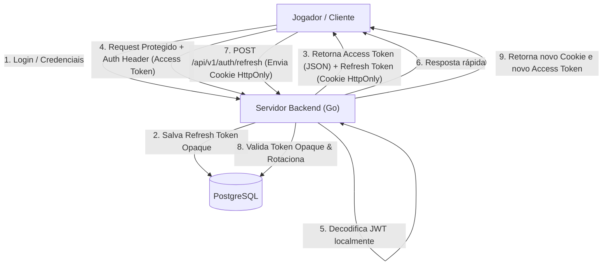

# Política de Gerenciamento de Access Tokens e Refresh Tokens

Este documento detalha a arquitetura técnica de controle, transmissão, rotação e expiração das sessões de usuários através do mecanismo de Access Tokens (JWT) e Refresh Tokens (Opaque Stateful) na plataforma Snooker Multiplayer.

---

## 1. Visão Geral da Estratégia de Sessão

Adotamos um modelo híbrido para maximizar a segurança contra vulnerabilidades Web (como XSS) e otimizar a performance do servidor (stateless validation para a maioria das requisições).



---

## 2. Especificação e Características dos Tokens

### 2.1. Access Token (JWT - Stateless)
*   **Formato:** JSON Web Token (JWT) assinado com o algoritmo **HS256**.
*   **Tempo de Vida (TTL):** 15 minutos.
*   **Armazenamento no Cliente:** Armazenado na memória volátil da aplicação (variável no código do frontend). **Nunca** persistido no `localStorage` ou `sessionStorage` para evitar roubo via XSS.
*   **Transmissão:** Enviado no cabeçalho HTTP `Authorization: Bearer <token>` em todas as requisições protegidas da API e durante o handshake do WebSocket.
*   **Validação:** Stateless (o backend em Go valida apenas a assinatura e expiração matemática localmente, sem bater no banco).

### 2.2. Refresh Token (Opaque - Stateful)
*   **Formato:** String criptograficamente segura gerada de forma pseudo-aleatória de alta entropia (ex: UUID v4 ou string aleatória de 64 bytes).
*   **Tempo de Vida (TTL):** 7 dias.
*   **Armazenamento no Cliente:** Enviado e armazenado de forma automática em **Cookie seguro (HttpOnly, Secure, SameSite=Strict)**.
    *   *HttpOnly:* Impede qualquer script JavaScript de ler o cookie.
    *   *Secure:* Exige tráfego via HTTPS.
    *   *SameSite=Strict:* Bloqueia o envio do cookie em requisições de origem cruzada, eliminando o risco de ataques CSRF (Cross-Site Request Forgery).
*   **Validação:** Stateful (o backend em Go valida a sua presença e data de expiração consultando a tabela correspondente no banco de dados).

---

## 3. Modelo de Dados (Tabela de Refresh Tokens)

Para dar suporte a múltiplos dispositivos simultâneos de forma organizada e implementar a detecção de reuso, modelamos a tabela no PostgreSQL da seguinte forma:

```sql
CREATE TABLE refresh_tokens (
    id UUID PRIMARY KEY DEFAULT uuid_generate_v4(),
    user_id UUID NOT NULL REFERENCES usuarios(id) ON DELETE CASCADE,
    token_hash VARCHAR(255) UNIQUE NOT NULL, -- Hash SHA-256 do token opaco
    family_id UUID NOT NULL,                 -- Identificador do dispositivo/família de rotação
    expires_at TIMESTAMP WITH TIME ZONE NOT NULL,
    revoked BOOLEAN NOT NULL DEFAULT FALSE,
    created_at TIMESTAMP WITH TIME ZONE DEFAULT CURRENT_TIMESTAMP
);

-- Índices de busca rápida e expiração
CREATE INDEX idx_refresh_tokens_hash ON refresh_tokens(token_hash);
CREATE INDEX idx_refresh_tokens_family ON refresh_tokens(family_id);
```

---

## 4. Rotação de Refresh Tokens (RTR) e Detecção de Reuso

Para evitar que um Refresh Token interceptado de alguma forma comprometa a conta permanentemente, implementamos a **Rotação Ativa de Tokens (RTR)**.

### Fluxo Normal de Refresh:
1.  O Access Token expira (após 15 minutos).
2.  O cliente chama `POST /api/v1/auth/refresh` enviando o Cookie do Refresh Token atual ($RT_1$).
3.  O Go lê o token, calcula o hash SHA-256 e verifica se existe no PostgreSQL com status ativo (`revoked = false` e `expires_at > NOW()`).
4.  O servidor Go gera um novo par: Access Token novo e um novo Refresh Token ($RT_2$).
5.  O Go atualiza $RT_1$ no banco marcando `revoked = true`.
6.  O Go insere $RT_2$ no banco vinculando-o à mesma `family_id` do token anterior.
7.  O Go responde enviando o novo cookie contendo $RT_2$ e o novo Access Token no corpo JSON.

### Fluxo de Detecção de Reuso (Ataque):
Se um invasor interceptar o Refresh Token $RT_1$ e tentar usá-lo após o cliente legítimo já ter realizado a rotação (ou vice-versa):
1.  O servidor recebe uma chamada para `POST /api/v1/auth/refresh` contendo o Cookie de $RT_1$.
2.  O Go calcula o hash e consulta o banco de dados.
3.  O servidor constata que $RT_1$ já foi **revogado** anteriormente.
4.  **Ação de Segurança Imediata:** O Go identifica uma tentativa de reuso. Ele marca **todos os tokens** da mesma `family_id` (incluindo o token ativo $RT_2$) como `revoked = true` no banco de dados.
5.  O servidor retorna `401 Unauthorized` e força o cliente a realizar login manual (usuário e senha) novamente para gerar uma nova família segura.

---

## 5. Endpoints Relacionados

### 5.1. Refresh Session
*   **Endpoint:** `POST /api/v1/auth/refresh`
*   **Autenticação:** Nenhuma (o token vem no Cookie `refresh_token`)
*   **Response Headers:**
    ```http
    Set-Cookie: refresh_token=RT_VALUE_NEW; Path=/api/v1/auth; HttpOnly; Secure; SameSite=Strict; Max-Age=604800
    ```
*   **Response Body (200 OK):**
    ```json
    {
      "access_token": "eyJhbGciOi..."
    }
    ```

### 5.2. Logout (Revogação Manual)
*   **Endpoint:** `POST /api/v1/auth/logout`
*   **Autenticação:** Requer Access Token
*   **Ação no Banco:** O servidor extrai o `user_id` do JWT e o `refresh_token` do cookie da requisição, marca o token no banco como `revoked = true` e limpa o cookie no cliente.
*   **Response Headers:**
    ```http
    Set-Cookie: refresh_token=; Path=/api/v1/auth; HttpOnly; Secure; SameSite=Strict; Max-Age=0
    ```
*   **Response Body (200 OK):**
    ```json
    {
      "message": "Sessão encerrada com sucesso"
    }
    ```
