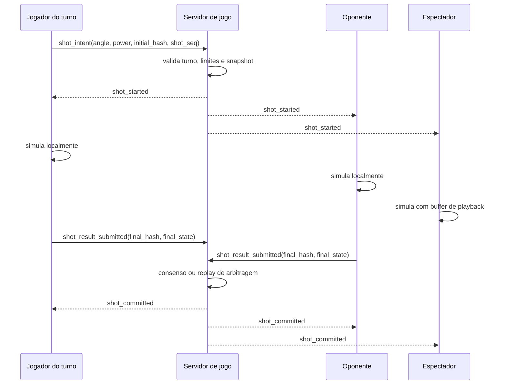
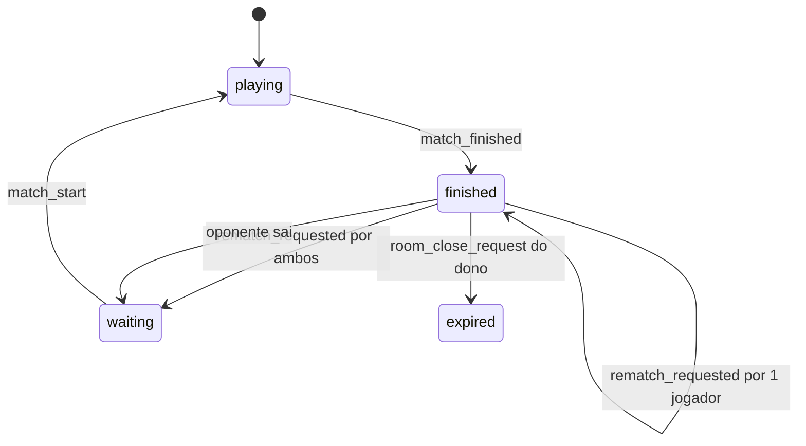

# Gameplay state and physics architecture

Este documento detalha o contrato operacional definido no ADR 0008 para estado de partida, fisica deterministica, consenso de jogadas e experiencia de espectadores.

## Objetivos

- Permitir que dois oponentes vejam a mesma fisica sem streaming de frames.
- Permitir espectadores com experiencia fluida, mesmo ao entrar no meio da partida.
- Manter o servidor como autoridade de ordem, turno e snapshots confirmados.
- Preservar baixo custo operacional com fisica client-side deterministicamente reproduzivel.
- Criar caminho claro para auditoria e arbitragem quando houver divergencia.

## Decisao Resumida

O gameplay usa replay deterministico orientado a eventos:

1. O servidor guarda o ultimo snapshot confirmado.
2. O jogador do turno envia a intencao da tacada.
3. O servidor valida turno, sequencia e limites.
4. O servidor publica `shot_started`.
5. Jogadores e espectadores simulam localmente.
6. Jogadores enviam o resultado final.
7. O servidor confirma por consenso ou arbitra por replay server-side.
8. O servidor publica o proximo snapshot canonico.



## Autoridade de Estado

### Servidor

O servidor e autoridade sobre:

- `match_id`
- jogadores e papeis
- espectadores conectados
- `physics_version`
- `seed`
- `shot_seq`
- jogador do turno
- estado da partida: `waiting`, `playing`, `shot_active`, `awaiting_consensus`, `disputed`, `finished`
- ultimo snapshot confirmado
- hash do ultimo snapshot confirmado
- tacada ativa, quando existir
- event log recente
- resultado da partida

### Jogadores

Jogadores podem:

- mirar e solicitar tacada apenas quando for seu turno;
- simular a tacada localmente;
- reportar estado final canonico;
- receber commits oficiais do servidor.

Jogadores nao podem:

- alterar snapshot confirmado diretamente;
- definir proximo turno;
- finalizar partida localmente;
- enviar evento de tacada fora de sequencia.

### Espectadores

Espectadores podem:

- receber snapshots e eventos de tacada;
- reproduzir a simulacao localmente;
- entrar no meio da partida por `spectator_sync`;
- assistir com atraso intencional curto.

Espectadores nao podem:

- participar do consenso;
- enviar resultado de tacada;
- afetar turno, placar ou snapshot oficial.

## Estado Canonico

O snapshot canonico deve ser pequeno, ordenado e estavel.

Exemplo:

```json
{
  "match_id": "match-123",
  "physics_version": "2026.06.1",
  "seed": "8f4f3a",
  "shot_seq": 12,
  "turn_user_id": "user-a",
  "balls": [
    { "id": 0, "x": -6080, "y": 0, "vx": 0, "vy": 0, "sunk": false },
    { "id": 1, "x": 1200, "y": 340, "vx": 0, "vy": 0, "sunk": false }
  ],
  "rules": {
    "mode": "paper-shot",
    "table": "round-v1"
  }
}
```

Regras:

- bolas sempre ordenadas por `id`;
- coordenadas e velocidades quantizadas em inteiros;
- valores opcionais ausentes devem ter default documentado;
- hash deve usar serializacao canonica;
- hash deve incluir `physics_version`, `seed`, `shot_seq`, regras e estado das bolas;
- hash nao deve incluir timestamps, locale, FPS, dados de UI ou nomes de jogadores.

## Engine Deterministica

Requisitos obrigatorios:

- timestep fixo para simulacao;
- PRNG seedado pelo servidor;
- nenhuma chamada a `Math.random` dentro do caminho canonico;
- nenhuma dependencia de `Date.now` para estado ou hash;
- fisica separada do render;
- render pode interpolar, mas nao muda o estado canonico;
- versao da engine deve ser enviada pelo servidor e incluida no hash.

Recomendacao inicial:

- simular em ticks fixos de 120 Hz;
- renderizar em FPS livre;
- usar fast-forward sem render para espectadores ou reconexao;
- manter um limite maximo de ticks por tacada para evitar loops infinitos.

## Protocolo de Tacada

### 1. `match_initialized`

Enviado quando a partida comeca.

Campos minimos:

```json
{
  "type": "match_initialized",
  "payload": {
    "match_id": "match-123",
    "room_id": "room-123",
    "physics_version": "2026.06.1",
    "seed": "8f4f3a",
    "shot_seq": 0,
    "turn_user_id": "user-a",
    "snapshot": {},
    "snapshot_hash": "abc"
  }
}
```

### 2. `shot_started`

Publicado somente depois que o servidor valida a intencao da tacada.

Campos minimos:

```json
{
  "type": "shot_started",
  "sender_id": "user-a",
  "payload": {
    "match_id": "match-123",
    "shot_seq": 13,
    "initial_hash": "abc",
    "angle": 1.42,
    "power": 67,
    "spin": { "x": 0, "y": 0 },
    "server_started_at_ms": 123456789,
    "physics_version": "2026.06.1"
  }
}
```

### 3. `shot_result_submitted`

Enviado pelos jogadores ao fim da simulacao local.

Campos minimos:

```json
{
  "type": "shot_result_submitted",
  "payload": {
    "match_id": "match-123",
    "shot_seq": 13,
    "initial_hash": "abc",
    "final_hash": "def",
    "final_state": {},
    "simulated_ticks": 421
  }
}
```

### 4. `shot_committed`

Publicado quando o servidor aceita a jogada.

Campos minimos:

```json
{
  "type": "shot_committed",
  "payload": {
    "match_id": "match-123",
    "shot_seq": 13,
    "snapshot": {},
    "snapshot_hash": "def",
    "next_turn_user_id": "user-b",
    "commit_reason": "player_consensus"
  }
}
```

`commit_reason` pode ser:

- `player_consensus`
- `server_replay`
- `timeout_verified`
- `admin_resolution`

### 5. `shot_disputed`

Publicado quando os resultados nao batem ou quando o consenso expira.

Campos minimos:

```json
{
  "type": "shot_disputed",
  "payload": {
    "match_id": "match-123",
    "shot_seq": 13,
    "reason": "hash_mismatch",
    "expected_reports": 2,
    "received_reports": 2
  }
}
```

## Consenso e Arbitragem

Regra base:

- dois hashes iguais dos jogadores confirmam a jogada;
- divergencia aciona replay server-side;
- ausencia de um jogador ate timeout aciona replay server-side;
- se o replay server-side bater com um report, esse estado vira oficial;
- se nenhum report bater e o replay existir, o estado do replay vira oficial e a partida registra suspeita;
- se nao houver replay disponivel, a partida pausa como `disputed`.

O verificador server-side nao precisa rodar em toda tacada no MVP. Ele deve existir para:

- disputas;
- timeout de resultado;
- amostragem antifraude;
- partidas ranqueadas ou torneios futuros.

## Experiencia de Espectadores

Espectadores usam `spectator playback`.

Principios:

- espectador ve fluidez, nao latencia minima;
- usar buffer intencional entre 300ms e 800ms;
- nunca depender de frames enviados pelo servidor;
- reproduzir a tacada localmente a partir de eventos;
- aplicar correcao visual suave quando o commit oficial divergir do estado local.

### Entrada antes da tacada

O espectador recebe o ultimo snapshot confirmado e aguarda `shot_started`.

### Entrada durante a tacada

O servidor envia `spectator_sync`.

```json
{
  "type": "spectator_sync",
  "payload": {
    "match_id": "match-123",
    "snapshot": {},
    "snapshot_hash": "abc",
    "active_shot": {
      "shot_seq": 13,
      "angle": 1.42,
      "power": 67,
      "spin": { "x": 0, "y": 0 },
      "server_started_at_ms": 123456789,
      "physics_version": "2026.06.1"
    },
    "playback_delay_ms": 600
  }
}
```

O cliente deve:

1. carregar o snapshot;
2. calcular o alvo de playback: `now_server_ms - playback_delay_ms`;
3. simular sem render ate o tick correspondente;
4. iniciar renderizacao a partir desse ponto;
5. continuar em tempo normal.

Para MVP, se o fast-forward ainda nao estiver pronto, o espectador pode ver uma tela curta de sincronizacao e entrar no proximo `shot_committed`.

### Correcao visual

Quando `shot_committed` chegar:

- se o estado local bater com o snapshot oficial, seguir normalmente;
- se houver pequena diferenca, interpolar bolas para o estado oficial em 150ms a 300ms;
- se houver grande diferenca, mostrar "validando jogada" e aplicar transicao de snapshot;
- nunca teletransportar bolas sem transicao visual.

## Event Log e Recuperacao

O servidor deve manter um log recente por partida:

- `match_initialized`
- todas as `shot_started`
- todos os `shot_committed`
- `shot_disputed`
- `match_finished`

Esse log permite:

- reconexao;
- entrada tardia de espectador;
- auditoria;
- replay de partida;
- diagnostico de divergencia.

Snapshots confirmados devem ser armazenados ao final de cada tacada. O log completo pode ser persistido apenas para partidas finalizadas, partidas ranqueadas ou disputas.

## Telemetria de Taco

Durante `turn_active`, o cliente do jogador da vez deve enviar `cue_state` por WebSocket para que o oponente e os espectadores acompanhem a mira em tempo quase real. Esse estado inclui a forca da tacada, pois o render do taco 3D deve usar `angle` e `power` juntos para calcular orientacao, recuo e posicao visual do taco.

Esse evento e efemero:

- nao entra no hash canonico;
- nao altera snapshot;
- nao define tacada;
- nao substitui `shot_started`;
- pode ser descartado para clientes lentos;
- deve ser limitado pelo cliente para evitar spam.

Frequencia recomendada:

- 10 Hz a 20 Hz durante movimento de mira;
- envio imediato quando o jogador muda de estado entre mirando e parado;
- sem persistencia em banco.

Campos minimos:

```json
{
  "type": "cue_state",
  "sender_id": "user-a",
  "payload": {
    "match_id": "match-123",
    "shot_seq": 13,
    "turn_user_id": "user-a",
    "x": -6080,
    "y": 0,
    "angle": 1.42,
    "power": 67,
    "is_aiming": true,
    "client_seq": 37,
    "server_received_at_ms": 123456789
  }
}
```

Validacoes do servidor:

- apenas participante da sala pode enviar;
- sala precisa estar em `playing`;
- payload precisa ter numeros finitos;
- `angle` deve estar em intervalo normalizado;
- `power` deve ficar entre 0 e 100 e representa a forca/recuo do taco durante a mira;
- espectadores nunca podem emitir `cue_state`.

O cliente deve ignorar `cue_state` antigo quando `client_seq` for menor que o ultimo visto para o mesmo jogador.

## MVP Jogavel Integrado

A primeira versao jogavel usa o core 3D original dentro do frontend principal. Cada jogador tem discos proprios:

- dono da sala: discos amarelos (`1` a `7`);
- oponente: discos azuis (`9` a `15`);
- disco preto (`8`): disco neutro de bonus/finalizacao.

O placar e calculado no cliente a partir dos discos encaixados e sincronizado por snapshot efemero da sala:

- disco de jogador vale 10 pontos para o dono daquele conjunto;
- disco preto vale 30 pontos para o jogador que executou a tacada;
- a partida termina quando um conjunto e limpo ou quando o disco preto define vencedor por placar.

Eventos de gameplay usados pelo MVP:

- `shot_started`: enviado pelo jogador do turno com `shot_seq`, `angle`, `power` e `shooter_user_id`;
- `game_state_sync`: snapshot pos-tacada com bolas, buracos, placar, turno, status e hash de auditoria;
- `match_finished`: sala passa para `finished`, carrega vencedor e premios de XP.

O servidor ainda nao valida a fisica no meio da jogada. A decisao de arquitetura segue sendo evoluir este fluxo para auditoria deterministica server-side, mas o MVP ja compartilha mira, forca, inicio da tacada e snapshot final para manter oponente e espectadores alinhados.

## Chat Durante a Partida

O chat da sala continua ativo durante o jogo pelo mesmo WebSocket da sala.

Regras:

- jogadores podem enviar `chat_message` durante lobby, partida e pos-partida;
- espectadores recebem chat, mas o MVP pode manter espectadores como somente leitura;
- historico recente deve continuar vindo do stream da sala;
- navegar entre lobby e jogo nao deve apagar o historico, pois a assinatura do stream entrega as mensagens anteriores.

## Pos-Partida, Revanche e Encerramento

Quando a partida termina, o servidor publica `match_finished` e atualiza a sala para `finished`.

Efeito esperado:

1. clientes veem a tela de revanche/fim de partida;
2. o chat continua ativo;
3. a sala fica viva para decisao de revanche, volta ao lobby ou encerramento;
4. premios de XP sao adicionados ao perfil dos participantes.

### Opcoes do dono da sala

- `rematch_request`: sinaliza que deseja manter a sala para nova partida;
- `room_close_request`: encerra a sala e remove a sala da lista publica.

### Opcoes do oponente

- `rematch_request`: sinaliza que deseja permanecer para a proxima partida;
- `leave_room`: sai da sala e libera a vaga.

### Fluxo de revanche



Quando ambos os jogadores pedem revanche:

- servidor reseta a sala para `waiting`;
- `opponent_id` permanece preenchido;
- convites antigos continuam limpos;
- estados locais de pronto voltam para falso;
- servidor publica `room_reset`;
- dono pode iniciar novamente depois que ambos marcarem pronto.

Eventos minimos:

```json
{
  "type": "match_finished",
  "payload": {
    "room": {},
    "reason": "normal",
    "winner_user_id": "user-a",
    "xp_awards": [
      { "user_id": "user-a", "xp_delta": 50, "total_xp": 250 },
      { "user_id": "user-b", "xp_delta": 25, "total_xp": 175 }
    ]
  }
}
```

```json
{
  "type": "rematch_requested",
  "sender_id": "user-a",
  "payload": {
    "room_id": "room-123",
    "user_id": "user-a"
  }
}
```

```json
{
  "type": "room_reset",
  "payload": {
    "room": {}
  }
}
```

## Fases de Implementacao

### Fase 1: MVP seguro o suficiente

- criar rota de jogo integrada ao frontend principal;
- extrair engine de fisica para modulo puro;
- remover aleatoriedade nao seedada do caminho canonico;
- implementar `shot_started` e `game_state_sync` no MVP;
- implementar `cue_state` efemero para mira do jogador do turno;
- manter chat ativo na tela de jogo;
- implementar `match_finished`, `rematch_requested` e `room_reset`;
- premiar XP por partida finalizada e refletir no perfil;
- manter spectators no proximo snapshot confirmado se entrarem durante movimento;
- guardar ultimo snapshot confirmado no servidor.

### Fase 2: Spectator playback fluido

- implementar `spectator_sync`;
- implementar buffer de 300ms a 800ms;
- implementar fast-forward sem render;
- implementar correcao visual suave no commit.

### Fase 3: Arbitragem robusta

- implementar verificador server-side por replay deterministico;
- adicionar `shot_disputed`;
- adicionar amostragem antifraude;
- persistir event log de partidas relevantes.

### Fase 4: Produto competitivo

- ranking/XP com base em `match_finished`;
- replay assistivel de partidas encerradas;
- politicas de abandono e desconexao;
- telemetria de divergencias por browser, dispositivo e `physics_version`.

## Criterios de Aceite

- Dois clientes recebem o mesmo `shot_started` e chegam ao mesmo `final_hash`.
- Espectador conectado antes da tacada ve a animacao local sem frames vindos do servidor.
- Espectador conectado durante movimento consegue sincronizar sem quebrar a partida.
- Reconexao recupera ultimo snapshot confirmado e tacada ativa, se houver.
- Divergencia de hash nao altera o snapshot oficial sem commit do servidor.
- Hash canonico nao muda entre browsers suportados para o mesmo input.
- O servidor rejeita tacadas fora de turno, fora de sequencia ou com `initial_hash` antigo.
