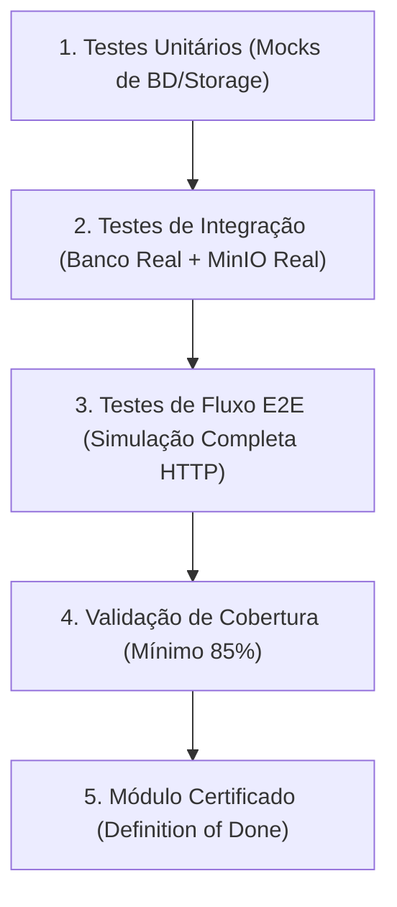

# Especificação Técnica: Plano de Testes, Validação e Critérios de Conclusão (DoD)

> [!IMPORTANT]  
> **OS TESTES NÃO SÃO UMA ETAPA OPCIONAL OU SECUNDÁRIA.**  
> Esta especificação estabelece que os testes automatizados são a evidência primária e obrigatória de qualidade do software. Este módulo de Autenticação e Onboarding **APENAS será considerado como implementado/concluído quando 100% dos testes da suíte passarem** e a cobertura de código atingir a meta mínima especificada. Nenhuma implementação parcial em código será aceita sem a respectiva cobertura e sucesso de testes correspondentes.

---

## 1. Níveis de Testes Obrigatórios

A validação de qualidade do código de Autenticação deve ocorrer em três camadas isoladas:



---

## 2. Testes Unitários (Unit Tests)

Focados puramente em lógica interna de funções, tratamento de strings e validação de regras de domínio. **Não devem realizar chamadas de rede ou conexões a bancos de dados externos.**

*   **Ferramenta padrão:** Pacote nativo `testing` do Go ou bibliotecas auxiliares como `testify`.
*   **Componentes a Testar:**
    *   **Geração e Validação de Senha (bcrypt):** Sucesso em criptografia e rejeição de senhas fracas.
    *   **Validadores de DTOs:** Verificar se structs de cadastro validam e-mails, tamanhos de caracteres de display_name e biografia corretamente.
    *   **Lógica de claims do JWT:** Garantir que a decodificação de claims retorna a data de expiração e status esperados.
*   **Mocks:** Utilizar `go-sqlmock` para o banco de dados e mocks gerados por ferramentas como `mockery` para interfaces de armazenamento.

---

## 3. Testes de Integração (Integration Tests)

Devem validar a comunicação real do microsserviço Go com as ferramentas periféricas de persistência (PostgreSQL e MinIO).

*   **Ambiente de Testes:** Utilização de **Testcontainers para Go** ou um arquivo `docker-compose.test.yml` dedicado para subir instâncias limpas do PostgreSQL e MinIO no ambiente local de testes ou na esteira de CI/CD.
*   **Cenários Obrigatórios a Validar:**
    *   **Persistência de Transição de Estado:** Criar usuário em banco real com status `onboarding_pending`, alterar para `active` e validar se o campo `updated_at` foi alterado.
    *   **Concorrência do Grace Period (RTR):** Simular no PostgreSQL escritas de tokens revogados e verificar se chamadas assíncronas concorrentes de teste com intervalo menor que 15 segundos são atendidas com sucesso, enquanto requisições posteriores a esse prazo são rejeitadas.
    *   **Cópia física no MinIO/S3:** Conectar-se à porta de testes do MinIO, gerar a URL pré-assinada, enviar uma imagem de teste via HTTP PUT, e validar se o arquivo foi persistido no bucket temporário antes de disparar o comando de consolidação de perfil.

---

## 4. Testes de Fluxo de Ponta a Ponta (E2E Tests)

Estes testes validam toda a API através de requisições HTTP simuladas que emulam o comportamento real do cliente frontend.

*   **Ferramenta:** `net/http/httptest` do Go para instanciar o roteador (Gin/Fiber) na memória de testes.
*   **Fluxo de Teste E2E Obrigatório:**
    ```text
    1. Executa POST /signup com credenciais de teste ➔ Sucesso 201 + Retorno do Token Provisório.
    2. Tenta chamar GET /lobbies com o Token Provisório ➔ Espera 403 Forbidden.
    3. Chama GET /profile/upload-url com o Token Provisório ➔ Sucesso 200 + URL e Chave retornadas.
    4. Simula PUT do arquivo de imagem na URL recebida ➔ Sucesso 200.
    5. Executa POST /profile/complete enviando o Token Provisório e a chave ➔ Sucesso 200 + Token Definitivo.
    6. Tenta chamar GET /lobbies agora com o Token Definitivo ➔ Sucesso 200.
    ```

---

## 5. Critérios Rígidos de Cobertura e "Definition of Done" (DoD)

O módulo de autenticação só será aprovado e integrado à branch principal (Main/Master) quando satisfizer os seguintes critérios:

1.  **Sucesso Absoluto na Suíte:** 100% dos testes unitários, testes de integração e testes de fluxo E2E devem passar sem falhas (`PASS`).
2.  **Meta de Cobertura de Código:** A cobertura de código do pacote de autenticação e controllers associados deve ser de **no mínimo 85%**.
    *   *Comando de Validação:*
        ```bash
        go test -coverprofile=coverage.out ./auth/...
        go tool cover -func=coverage.out
        ```
3.  **Execução em Pipelines de CI/CD:** Os testes de integração reais (Postgres e MinIO via testcontainers/compose) devem passar de forma automática em todas as esteiras antes do Merge Request ser liberado para revisão por pares.
